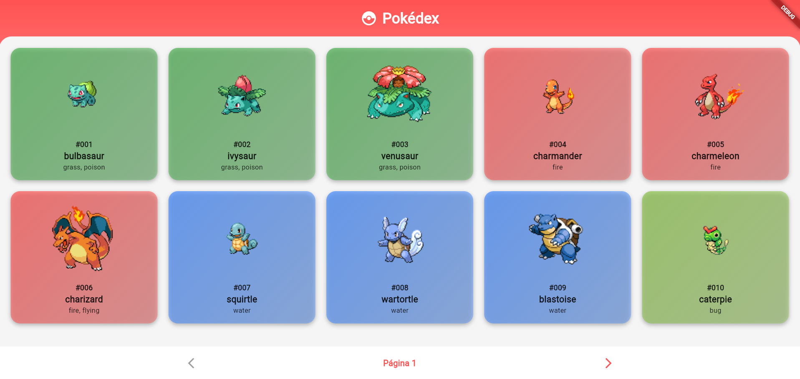
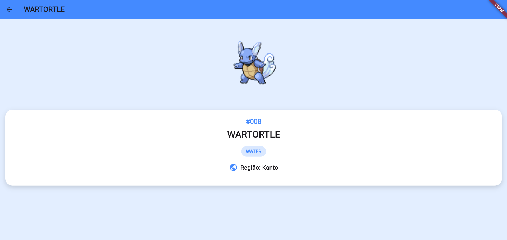

# Pokédex App

Aplicativo de Pokédex desenvolvido em Flutter que consome a [PokéAPI](https://pokeapi.co/) para exibir informações dos Pokémons da primeira geração.

## Screenshots

<div align="center">
  
  
</div>

## Funcionalidades

- Lista de Pokémons em grid com paginação
- Exibição de 10 Pokémons por página (151 no total)
- Tela de detalhes com informações de cada Pokémon
- Navegação entre páginas (anterior/próxima)

## Tecnologias

- Flutter / Dart
- [PokéAPI](https://pokeapi.co/)
- Pacote `http` para requisições

## Estrutura

```
lib/
├── main.dart                 # Configuração inicial do app
├── models/
│   └── pokemon.dart          # Modelo de dados do Pokémon
├── pages/
│   ├── home_page.dart        # Tela principal com lista
│   └── details_page.dart     # Tela de detalhes
├── services/
│   └── poke_api_service.dart # Comunicação com a API
└── widgets/
    └── pokemon_card.dart     # Card personalizado
```
